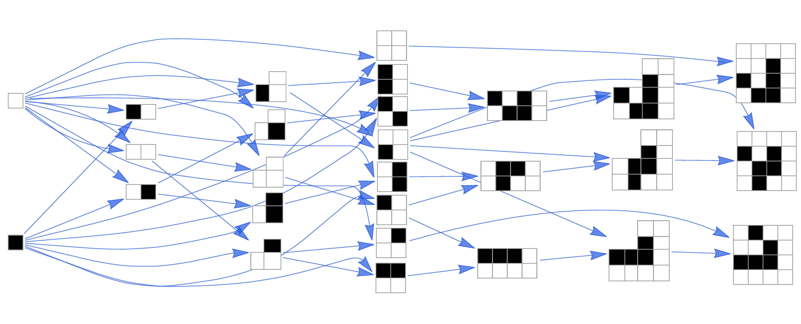

# AssemblyCA: A Benchmark of Open-Endedness for Discrete Cellular Automata



> **NeurIPS Workshop on Agent Learning in Open-Endedness (ALOE) 2023**
>
> Keith Y. Patarroyo · Abhishek Sharma · Sara I. Walker · Leroy Cronin
>
> Complex Chemistry Labs, University of Glasgow &nbsp;|&nbsp; School of Earth and Space Exploration, Arizona State University
>
> [[Paper]](https://openreview.net/pdf?id=5cEQ4ZOsIN) &nbsp;|&nbsp; [[Project Page]](https://assemblyca.github.io/)

---

## Overview

**AssemblyCA** introduces a framework for measuring **open-endedness** in discrete dynamical systems by combining **Cellular Automata (CA)** with **Assembly Theory** — a formalism originally developed to quantify molecular complexity and the origins of life.

The central idea is that truly open-ended systems indefinitely generate novel, diverse, and complex objects. We use an *assembly theory* derived metric as a rigorous complexity measure that captures **historical contingency** — something traditional entropy or diversity metrics cannot. This allows us to distinguish between:

| Exploration Type | Description | Complexity Outcome |
|---|---|---|
| **Undirected (random soup)** | Random initial conditions, no selection | Low complexity, high copy number |
| **Open-ended (LifeWiki community)** | Human-curated discovery over 50 years | High complexity, systematically increasing |
| **Algorithmic agents** | Programmed modification of patterns | Moderate complexity, plateaus without selection |

The benchmark uses data collected up to **2023**, drawing from the Game of Life Catagolue census, the LifeWiki pattern database, and agent-based searches.

---

## Key Contributions

- **Hash Assembly algorithm** — an efficient method to compute the assembly index of CA configurations using a hierarchical hashing approach inspired by Hashlife
- **Benchmark across three exploration regimes** — random soups, community-discovered patterns, and algorithmic agents
- **Assembly Theory metric as an open-endedness metric** — captures selection and historical contingency beyond entropy
- **Analysis of Game of Life Patterns**, iconic Game of Life patterns (gliders, guns, breeders, oscillators), soup searches from Catagolue and culturally significant structures from LifeWiki (up to 2023)
- **Agent-based search** for finding high-assembly CA objects by agents querying a library

---

## Installation

**Requirements:** Python 3.10+

1. Clone the repository and its submodules:

```bash
git clone https://github.com/assemblyca/assemblyca.git
cd assemblyca
git submodule update --init --recursive
```

2. Install Python dependencies:

```bash
pip install -r requirements.txt
```

---

## Usage

All analyses from the paper are reproduced in a single self-contained Jupyter notebook:

```bash
jupyter notebook HashAssembly.ipynb
```

The notebook walks through:

1. **Hash Assembly algorithm** — definition and implementation
2. **CA analysis** — assembly index across different CA rules, 1D,2D,3D with different rules and neighborhoods
3. **Benchmarking** — comparison of hash assembly against the exact assembly index and entropy
4. **Game of Life patterns** — assembly of gliders, guns, oscillators, and breeders
5. **Soup Search Experiments** — assembly complexity of soup Experiments (up to 2023)
6. **Cultural patterns** — assembly complexity of Wikipedia structures over time (up to 2023)
7. **Agent search** — searching CA high-assembly objects by agents querying a library


---

## Repository Structure

```
assemblyca/
├── HashAssembly.ipynb        # Main notebook (reproduces all paper results)
├── assemblyca_tools.py       # Core library: hash assembly, CA tools, plotting
├── hashlife/                 # Hashlife submodule (fast CA simulation)
├── agent_search/             # Agent-based search for high-assembly CA objects
├── apgmera/                  # apgmera submodule (finding patterns in long simulations)
├── benchmark_data/           # Benchmarking results vs. exact assembly index
├── rle_files/                # Game of Life patterns (RLE format)
├── rule_files/               # CA rule tables
├── soup_search/              # Random soup search experiments
├── wiki_patterns/            # Cultural patterns from Wikipedia (up to 2023)
├── pathway_images/           # Assembly pathway visualizations
└── requirements.txt          # Python dependencies
```

---

## Authors

| Name | Affiliation |
|---|---|
| Keith Y. Patarroyo | Complex Chemistry Labs, University of Glasgow |
| Abhishek Sharma | Complex Chemistry Labs, University of Glasgow |
| Sara I. Walker | School of Earth and Space Exploration, Arizona State University |
| Leroy Cronin | Complex Chemistry Labs, University of Glasgow |

---

## Citation

If you use this code or benchmark, please cite:

```bibtex
@inproceedings{patarroyo2023assemblyca,
  title     = {AssemblyCA: A Benchmark of Open-Endedness for Discrete Cellular Automata},
  author    = {Patarroyo, Keith Y. and Sharma, Abhishek and Walker, Sara I. and Cronin, Leroy},
  booktitle = {NeurIPS Workshop on Agent Learning in Open-Endedness (ALOE)},
  year      = {2023},
  url       = {https://openreview.net/pdf?id=5cEQ4ZOsIN}
}
```

---

## License

This project is released for academic use. See the paper for details.
